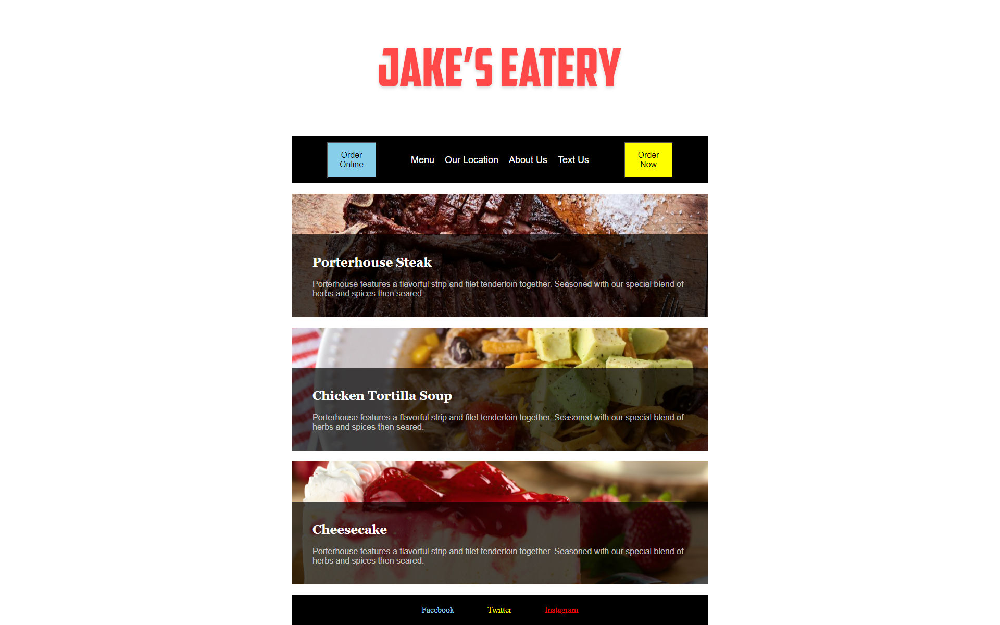

# :full_moon: About The Project

**Jakes Eatery** is an activity to test my knowledge of CSS Flexbox Skills at the **edX Front-End Web Development Bootcamp**.

# :waxing_gibbous_moon: Features

- Clean Code
- CSS Flexbox Layout
- HTML Semantic

# :first_quarter_moon: Screenshot

# :waxing_crescent_moon: Philosophy

N/A

# :new_moon: Technologies

- HTML
- CSS

# :globe_with_meridians: Website

- [Jakes Eatery](https://whybruno.github.io/jakes-eatery)

# :copyright: Credits

N/A

# :registered: License

MIT License